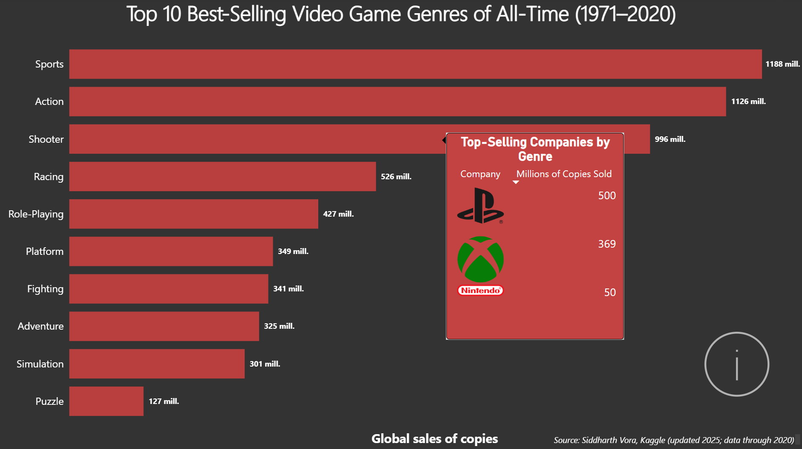

# 🎮 Video Game Sales Dashboard

**Created:** 2025\
**Last updated:** 12/11/2025

## 🎯 Goal

Identify which **video game genres and companies have historically sold the most (1971–2020)** to help a **video game company** determine which genres and platforms offer the highest potential profitability for future releases.

This approach focuses on **genres and companies rather than consoles**, since the best-selling console may no longer be in production, while genres and platforms provide long-term market insight.

------------------------------------------------------------------------

## ⚙️ Process

1.  **Basic Cleaning (Excel)**
    -   Adjusted sales values to **millions of units** for consistency and easier handling in Power BI.\
    -   Standardized missing or inconsistent entries before importing.
2.  **Data Cleaning, Manipulation & Analysis (SQL)**
    -   Imported and explored the dataset to understand key relationships between **genre**, **console**, and **global sales**.\
    -   Filtered and aggregated data to calculate **total sales per genre**.\
    -   Generated a **historical Top 10 genres** list (1971–2020).\
    -   Identified the **top consoles for each genre**, focusing on currently active platforms.\
        📜 **Code:** See the full SQL cleaning and aggregation script in [SQL code](sql_code.sql)
3.  **Visualization (Power BI)**
    -   Built an **interactive dashboard** where:
        -   Clicking on a genre displays the **top-selling companies** for that category.\
        -   Hovering shows a **tooltip** with company rankings.\
    -   Applied a **clean, modern design** emphasizing readability and interaction.\
    -   Added a floating **info icon** explaining the tooltip functionality.\
    -   Standardized numeric formatting for clarity (sales displayed in millions).

------------------------------------------------------------------------

## 🧰 Tools & Technologies

-   **Excel** → basic data preparation\
-   **SQL** → cleaning, transformation, and aggregation\
-   **Power BI** → interactive visualization and dashboard design

**Dataset:** [Video Game Sales Dataset — Siddharth Vora (Kaggle, updated 2025; sales data through 2020)](https://www.kaggle.com/datasets/siddharth0935/video-game-sales)\
*Video game sales from North America, Japan, Europe, Africa, and other regions for 64,016 titles (1971–2024), including information such as critic score, genre, and platform.*

------------------------------------------------------------------------

## 📊 Results

The dashboard highlights the **most successful video game genres of all time (1971–2020)** and reveals the **companies leading each category**.

It enables a quick understanding of: - Which genres have historically dominated global sales.\
- How platform popularity varies by genre.\
- Which companies have consistently led specific categories.

📉 **Scope limitations:**\
- Sales data available **only up to 2020** → next-gen consoles like **PS5** and **Xbox Series X** lack complete data.\
- **PC sales excluded** due to inconsistent reporting of digital downloads.\
- Focused on **PlayStation, Xbox, and Nintendo** platforms for reliable data coverage.

------------------------------------------------------------------------

## 🚀 Next Steps

-   Add a **timeline filter** to visualize sales trends per genre over decades.\
-   Include **regional analysis** (e.g., North America vs. Japan).\
-   Expand the dashboard with a **console market share view** for each genre.\
-   Integrate an **AI-powered recommendation system** for predicting profitable genres for future releases.

------------------------------------------------------------------------

## 🖼️ Preview

**Interactive Dashboard:**\
- [View Online (Power BI Service)](https://app.powerbi.com/groups/me/reports/1b6c169d-80cc-46bb-a4b0-61dc4b1ca81d/e9b57bb07290e096667a?experience=power-bi)\
- [Download `.pbix` File](Dashboard.pbix)

------------------------------------------------------------------------

**Author:** [Pablo](https://github.com/PabloDataAnalyst) © 2025 Pablo. Shared publicly for portfolio purposes.\
**License:** MIT License.